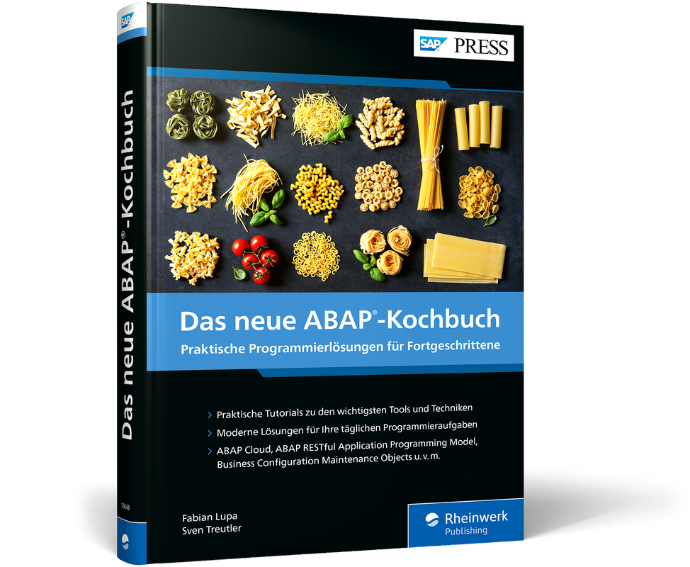
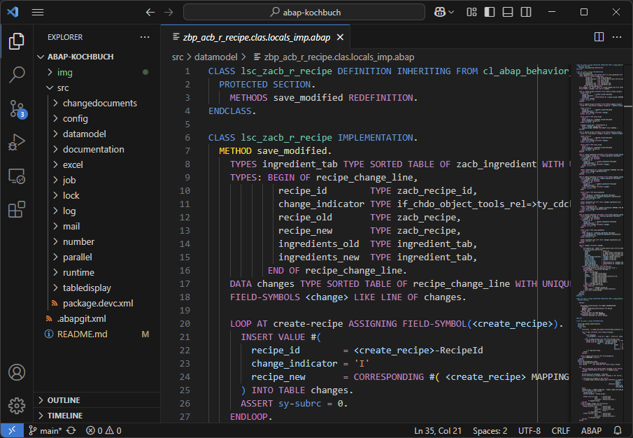

# Das neue ABAP-Kochbuch

Hier finden Sie zugehöriges Material zum neuen ABAP-Kochbuch (2025) als abapGit Repository.

> - [Kapitelbezug](#kapitelbezug)
> - [Anzeige im Texteditor / IDE](#anzeige-im-texteditor--ide)
> - [Installation im SAP-System](#installation-im-sap-system)
>   - [Voraussetzungen](#voraussetzungen)
>   - [🏠 Installation in SAP S/4HANA 2023 oder SAP S/4HANA Cloud Private Edition 2023](#-installation-in-sap-s4hana-2023-oder-sap-s4hana-cloud-private-edition-2023)
>     - [Installation von abapGit](#installation-von-abapgit)
>     - [Option A: Online Repository](#option-a-online-repository)
>     - [Option B: Offline Repository](#option-b-offline-repository)
>   - [☁️ Installation in SAP S/4HANA Cloud Public Edition oder SAP BTP ABAP Environment](#️-installation-in-sap-s4hana-cloud-public-edition-oder-sap-btp-abap-environment)
>     - [Installation des abapGit-Plugins für die ABAP Development Tools](#installation-des-abapgit-plugins-für-die-abap-development-tools)
>     - [Installation des Online Repositories](#installation-des-online-repositories)
>   - [Nacharbeiten](#nacharbeiten)
> - [Neue Benutzer anlegen](#neue-benutzer-anlegen)
> - [Problembehandlung](#problembehandlung)

## Kapitelbezug

Die Kapitel beziehen sich jeweils auf folgende Ordner / Unterpakete.

| Nr | Kapitel                                                        | Unterpaket                                   |
|----|----------------------------------------------------------------|----------------------------------------------|
| 2  |	Das Anwendungsszenario	                                      | [`DATAMODEL`](./src/datamodel)               |
| 3  |	Umgang mit Systemfeldern und Laufzeitinformationen	          | [`RUNTIME`](./src/runtime)                   |
| 4  |	Tabellenanalyse	                                              | [`TABLEDISPLAY`](./src/tabledisplay)         |
| 5  |	Tabellenpflege mit Business Configuration Maintenance Objects | [`CONFIG`](./src/config)                     |
| 6  |	Anwendungsprotokolle	                                        | [`LOG`](./src/log)                           |
| 7  |	Änderungsbelege	                                              | [`CHANGEDOCUMENTS`](./src/changedocuments)   |
| 8  |	Sperrobjekte	                                                | [`LOCK`](./src/lock)                         |
| 9  |	Nummernkreisobjekte	                                          | [`NUMBER`](./src/number)                     |
| 10 |	Hintergrundverarbeitung	                                      | [`JOB`](./src/job)                           |
| 11 |	E-Mail-Versand	                                              | [`MAIL`](./src/mail)                         |
| 12 |	Parallelisierung von Anwendungslogik	                        | [`PARALLEL`](./src/parallel)                 |
| 13 |	Dateiupload	                                                  | [`DATAMODEL`](./src/datamodel) (Erweiterung) |
| 14 |	Umgang mit Excel-Dateien	                                    | [`EXCEL`](./src/excel)                       |
| 15 |	Dokumentation von Entwicklungsobjekten	                      | [`DOCUMENTATION`](./src/documentation)       |
| 16 |	Berechtigungen	                                              | [`AUTHORIZATION`](./src/authorization)       |

## Anzeige im Texteditor / IDE

Ohne SAP-System können Sie quelltext-basierte Objekte direkt in den Datein im Ordner [src/](./src/) anschauen. Empfehlenswert sind Plugins zum Syntax Highlighting. Für Visual Studio Code finden Sie diese zum Beispiel im [Standalone ABAP Development Extension Pack](https://marketplace.visualstudio.com/items?itemName=larshp.standalone-abap-development). In der GitHub-Weboberfläche ist automatisch ABAP-Syntaxhighlighting verfügbar.

## Installation im SAP-System

### Voraussetzungen

Zur Installation in Ihrem System benötigen Sie eine der folgenden Laufzeitumgebungen. Der Link führt Sie zu relevanten Installationsanleitung.

- [`SAP S/4HANA 2023`](#-installation-in-sap-s4hana-2023-oder-sap-s4hana-cloud-private-edition-2023) "On-Premise" (oder neuer) _oder_
- [`SAP S/4HANA Cloud Private Edition 2023`](#-installation-in-sap-s4hana-2023-oder-sap-s4hana-cloud-private-edition-2023) (oder neuer) _oder_
- [`SAP S/4HANA Cloud Public Edition`](#️-installation-in-sap-s4hana-cloud-public-edition-oder-sap-btp-abap-environment) _oder_
- [`SAP BTP ABAP Environment`](#️-installation-in-sap-s4hana-cloud-public-edition-oder-sap-btp-abap-environment)

> __💡 Tipp__  
> Haben Sie kein passendes System im Zugriff, können Sie auch das kostenlose `SAP BTP ABAP Environment Trial` verwenden. Wie Sie einen Zugang anlegen und sich mit dem System verbinden, erfahren Sie in folgendem Tutorial: [Create an SAP BTP ABAP Environment Trial User](https://developers.sap.com/tutorials/abap-environment-trial-onboarding..html). Zur Installation dieses Repositories folgen Sie den Schritten unter [Installation im SAP BTP ABAP Environment](#️-installation-in-sap-s4hana-cloud-public-edition-oder-sap-btp-abap-environment).

### 🏠 Installation in SAP S/4HANA 2023 oder SAP S/4HANA Cloud Private Edition 2023

#### Installation von abapGit

> Referenzdokumentation: [Installation](https://docs.abapgit.org/user-guide/getting-started/install.html)

In SAP S/4HANA und SAP S/4HANA Cloud Private Edition verwenden Sie die Community-Version von abapGit. Sie muss im System installiert werden. Sie können prüfen, ob abapGit bereits installiert ist, indem Sie den Transaktionscode `ZABAPGIT` oder den Report `ZABAPGIT_STANDALONE` oder `ZABAPGIT` im System aufrufen. Sollte abapGit noch nicht installiert sein, folgen Sie den Anweisungen unter [Installation](https://docs.abapgit.org/user-guide/getting-started/install.html) in Abstimmung mit Ihrem Systemverantwortlichen. Zur Installation dieses Repositories ist die Standalone-Version vollkommen ausreichend.

Dieses abapGit Repository verwendet die ABAP-Sprachversion _ABAP für Cloud-Entwicklung_. Die Unterstützung der ABAP-Sprachversion ist in abapGit noch recht neu. Stellen Sie daher sicher, dass Sie eine aktuelle Version von abapGit verwenden, um Probleme bei der Installation zu vermeiden.

Zur Installation des Repositories haben Sie zwei Optionen:

- **[Option A: Online Repository](#option-a-online-repository)**  
  Beim Online Repository verbindet sich Ihr SAP-System mit github.com, um die Entwicklungsobjekte zu importieren. Dafür ist eine Internetverbindung und die Einrichtung von SSL-Zertifikaten erforderlich.
- **[Option B: Offline Repository](#option-b-offline-repository)**  
  Beim Offline Repository exportieren Sie selbst die Entwicklungsobjekte als ZIP-Archiv und importieren Sie manuell ins System per Dateiupload. Dafür ist keine Internetkonnektivität erforderlich. Zur Aktualisierung müssen Sie diesen manuellen Schritt allerdings wiederholen.

#### Option A: Online Repository

> Referenzdokumentation: [Installing Online Repo](https://docs.abapgit.org/user-guide/projects/online/install.html)

> __🌍 Internetverbindung und Zertifikate__  
> Um ein Online Repository zu installieren, muss Ihr SAP-System sich mit github.com verbinden können. Neben der Netzwerkkonnektivität, müssen auch Zertifikate installiert sein. Details zur Installation dieser Zertifikate finden Sie unter [SSL Setup](https://docs.abapgit.org/user-guide/setup/ssl-setup.html). Zum Verbindungstest finden Sie Informationen unter [SSL Test](https://docs.abapgit.org/user-guide/setup/ssl-test.html).

1. Melden Sie sich in Anmeldesprache Deutsch `DE` im System per SAP GUI an.
2. Starten Sie abapGit (z. B. über Transaktion `SA38` und Report `ZABAPGIT_STANDALONE` oder Transaktioncode `ZABAPGIT`).
3. Klicken Sie in der Repository List oben auf `New Online`.
4. Füllen Sie das Formular wie folgt aus und bestätigen Sie mit _Create Online Repo_.  
      | Parameter                | Wert                                           |
      |--------------------------|------------------------------------------------|
      | Git Repository URL       | https://github.com/abap-kochbuch/abap-kochbuch |
      | Package                  | `$COOKBOOK`                                    |
      | Branch                   | `main`                                         |
      | Folder Logic             | Prefix                                         |
      
      Belassen Sie alle weiteren Parameter auf den Standardwerten.

      > __💡 Hinweis__  
      > Alternativ können Sie auch ein an das Transportwesen gebundenes Z-Paket `ZCOOKBOOK` verwenden.

5. Importieren Sie die Objekte in das System. Klicken Sie dazu auf _Pull_ und markieren Sie im anschließenden Dialogfenster alle Objekte. Diese sollten alle die Beschreibung _Add local object_ enthalten. Bestätigen Sie mit _Continue_.  
    > __💡 Hinweis__  
    > Es können an dieser Stelle einige Popups mit Hinweisen zur Originalsprache erscheinen. Diese sind dadurch bedingt, dass temporäre Pakete nur mit Originalsprache Englisch angelegt werden können, Sie aber auf Deutsch angemeldet sind. Bestätigen Sie diese Meldungen mit _Weiter_.

6. Aktivieren Sie die Objekte. Sie erhalten ein Popup mit Ihrem Aktivierungsarbeitsvorrat. Die relevanten Objekte sollten bereits markiert sein. Bestätigen Sie mit _Weiter_.

7. Es erscheint anschließend ein Protokoll. Dieses wird Warnungen und Fehler enthalten, die sie weitgehend ignorieren können. Beispielhaft ist nachfolgend ein Protokoll aufgeführt.  
    

    
Beispielprotokoll

    <pre>
    Wertetabelle ZACB_LABEL ist nicht aktiv
    Es wurde keine Wurzelentität in dieser BO-Struktur gefunden.
    Suchhilfezuordnung für Feld 'RecipeId' ist nicht aus Basisobjekt geerbt
    Suchhilfezuordnung für Feld 'Username' ist nicht aus Basisobjekt geerbt
    Suchhilfezuordnung für Feld 'LabelId' ist nicht aus Basisobjekt geerbt
    Es wurde keine Wurzelentität in dieser BO-Struktur gefunden.
    Annotat. AccessControl in View ZACB_C_INGREDIENT nicht zulässig, da keine in Basis-V. ZACB_R_INGREDIENT
    Annotat. AccessControl in View ZACB_C_REVIEW nicht zulässig, da keine in Basis-V. ZACB_R_REVIEW
    Wert der Annotation AccessControl in View ZACB_C_RECIPE weicht von BasisView ZACB_R_RECIPE ab
    Annotat. AccessControl in View ZACB_C_INGREDIENT nicht zulässig, da keine in Basis-V. ZACB_R_INGREDIENT
    Annotat. AccessControl in View ZACB_C_REVIEW nicht zulässig, da keine in Basis-V. ZACB_R_REVIEW
    Ddl Source ZACB_C_INGREDIENT wurde mit Warnungen aktiviert
    Ddl Source ZACB_C_RECIPE wurde mit Warnungen aktiviert
    Ddl Source ZACB_C_REVIEW wurde mit Warnungen aktiviert
    Ddl Source ZACB_I_LABELTEXT wurde mit Warnungen aktiviert
    Ddl Source ZACB_R_REVIEW wurde mit Warnungen aktiviert
    Domäne ZACB_LABEL_ID wurde mit Warnungen aktiviert
    Ddl Source ZACB_C_INGREDIENT wurde mit Warnungen aktiviert
    Ddl Source ZACB_C_RECIPE wurde mit Warnungen aktiviert
    Ddl Source ZACB_C_REVIEW wurde mit Warnungen aktiviert
    Ddl Source ZACB_I_LABELS2TEXT wurde mit Warnungen aktiviert
    Lead application of object 4F9AAAC1AF85701A29D36840344C4DHT does not exist
    Import of object 4F9AAAC1AF85701A29D36840344C4DHT failed
    Lead application of object DF11F804DF7836633258BF364C8D6CHT does not exist
    Import of object DF11F804DF7836633258BF364C8D6CHT failed
    Lead application of object F25AAD387E955B9D8EF69230A5417CHT does not exist
    Import of object F25AAD387E955B9D8EF69230A5417CHT failed
    Lead application of object F8EF7022FFDE645B8ECE5D0B7A485AHT does not exist
    Import of object F8EF7022FFDE645B8ECE5D0B7A485AHT failed
    </pre>
    

8. Fahren Sie mit den [Nacharbeiten](#nacharbeiten) fort.

#### Option B: Offline Repository

> Referenzdokumentation: [IInstalling Offline Repo](https://docs.abapgit.org/user-guide/projects/offline/install.html)

1. Laden Sie das ZIP-Archiv herunter. Den Downloadlink finden Sie auf der Verlagswebseite unter [www.sap-press.de/6050](www.sap-press.de/6050) auf der Registerkarte _Materialien_ oder auf [https://github.com/abap-kochbuch/abap-kochbuch](https://github.com/abap-kochbuch/abap-kochbuch) über den Button _Code_ und anschließenden Link _Download ZIP_.
2. Starten Sie abapGit (z. B. über Transaktion `SA38` und Report `ZABAPGIT_STANDALONE` oder Transaktioncode `ZABAPGIT`).
3. Klicken Sie in der Repository List oben auf `New Offline`.
4. Füllen Sie das Formular wie folgt aus.  
      | Parameter                | Wert                                           |
      |--------------------------|------------------------------------------------|
      | Name                     | Das neue ABAP-Kochbuch                         |
      | Package                  | `$COOKBOOK`                                    |
      | Folder Logic             | Prefix                                         |
      
      Belassen Sie alle weiteren Parameter auf den Standardwerten.

      > __💡 Hinweis__  
      > Alternativ können Sie auch ein an das Transportwesen gebundenes Z-Paket `ZCOOKBOOK` verwenden.

5. Klicken Sie auf den Button _Create Package_ und füllen Sie das Dialogfenster wie folgt aus. Bestätigen Sie anschließend mit _Weiter_.  
      | Parameter                | Wert                                           |
      |--------------------------|------------------------------------------------|
      | Paket                    | `$COOKBOOK`                                    |
      | Kurzbeschreibung         | Das neue ABAP-Kochbuch                         |
      | Softwarekomponente       | `LOCAL`                                        |
      | Transportschicht         | (leer)                                         |
      | Oberpaket                | (leer)                                         |

6. Klicken Sie auf den Button _Create Offline Repo_.

7. Klicken Sie auf den Button _Import zip_ und wählen Sie Ihre heruntergeladene ZIP-Datei aus. Bestätigen Sie ggf. Sicherheitsabfragen vom SAP GUI.

8. Importieren Sie die Objekte in das System. Klicken Sie dazu auf _Pull zip_ und markieren Sie im anschließenden Dialogfenster alle Objekte. Diese sollten alle die Beschreibung _Add local object_ enthalten. Bestätigen Sie mit _Continue_.  
    > __💡 Hinweis__  
    > Es können an dieser Stelle einige Popups mit Hinweisen zur Originalsprache erscheinen. Diese sind dadurch bedingt, dass temporäre Pakete nur mit Originalsprache Englisch angelegt werden können, Sie aber auf Deutsch angemeldet sind. Bestätigen Sie diese Meldungen mit _Weiter_.

9. Aktivieren Sie die Objekte. Sie erhalten ein Popup mit Ihrem Aktivierungsarbeitsvorrat. Die relevanten Objekte sollten bereits markiert sein. Bestätigen Sie mit _Weiter_.

10. Es erscheint anschließend ein Protokoll. Dieses wird Warnungen und Fehler enthalten, die sie weitgehend ignorieren können. Beispielhaft ist nachfolgend ein Protokoll aufgeführt.  
    

    
Beispielprotokoll

    <pre>
    Wertetabelle ZACB_LABEL ist nicht aktiv
    Es wurde keine Wurzelentität in dieser BO-Struktur gefunden.
    Suchhilfezuordnung für Feld 'RecipeId' ist nicht aus Basisobjekt geerbt
    Suchhilfezuordnung für Feld 'Username' ist nicht aus Basisobjekt geerbt
    Suchhilfezuordnung für Feld 'LabelId' ist nicht aus Basisobjekt geerbt
    Es wurde keine Wurzelentität in dieser BO-Struktur gefunden.
    Annotat. AccessControl in View ZACB_C_INGREDIENT nicht zulässig, da keine in Basis-V. ZACB_R_INGREDIENT
    Annotat. AccessControl in View ZACB_C_REVIEW nicht zulässig, da keine in Basis-V. ZACB_R_REVIEW
    Wert der Annotation AccessControl in View ZACB_C_RECIPE weicht von BasisView ZACB_R_RECIPE ab
    Annotat. AccessControl in View ZACB_C_INGREDIENT nicht zulässig, da keine in Basis-V. ZACB_R_INGREDIENT
    Annotat. AccessControl in View ZACB_C_REVIEW nicht zulässig, da keine in Basis-V. ZACB_R_REVIEW
    Ddl Source ZACB_C_INGREDIENT wurde mit Warnungen aktiviert
    Ddl Source ZACB_C_RECIPE wurde mit Warnungen aktiviert
    Ddl Source ZACB_C_REVIEW wurde mit Warnungen aktiviert
    Ddl Source ZACB_I_LABELTEXT wurde mit Warnungen aktiviert
    Ddl Source ZACB_R_REVIEW wurde mit Warnungen aktiviert
    Domäne ZACB_LABEL_ID wurde mit Warnungen aktiviert
    Ddl Source ZACB_C_INGREDIENT wurde mit Warnungen aktiviert
    Ddl Source ZACB_C_RECIPE wurde mit Warnungen aktiviert
    Ddl Source ZACB_C_REVIEW wurde mit Warnungen aktiviert
    Ddl Source ZACB_I_LABELS2TEXT wurde mit Warnungen aktiviert
    Lead application of object 4F9AAAC1AF85701A29D36840344C4DHT does not exist
    Import of object 4F9AAAC1AF85701A29D36840344C4DHT failed
    Lead application of object DF11F804DF7836633258BF364C8D6CHT does not exist
    Import of object DF11F804DF7836633258BF364C8D6CHT failed
    Lead application of object F25AAD387E955B9D8EF69230A5417CHT does not exist
    Import of object F25AAD387E955B9D8EF69230A5417CHT failed
    Lead application of object F8EF7022FFDE645B8ECE5D0B7A485AHT does not exist
    Import of object F8EF7022FFDE645B8ECE5D0B7A485AHT failed
    </pre>
    

11. Fahren Sie mit den [Nacharbeiten](#nacharbeiten) fort.

### ☁️ Installation in SAP S/4HANA Cloud Public Edition oder SAP BTP ABAP Environment

> Referenzdokumentation: [Import Content from abapGit Repository into the ABAP Environment](https://help.sap.com/docs/btp/sap-business-technology-platform/import-content-from-abapgit-repository-into-abap-environment)

#### Installation des abapGit-Plugins für die ABAP Development Tools

Die SAP-Version von abapGit ist in SAP S/4HANA Cloud Public Edition und im SAP BTP ABAP Environment bereits installiert. Sie benötigen lediglich das Plugin um in den ABAP Development Tools abapGit nutzen zu können. Folgen Sie dazu den Schritten im Tutorial [Install the abapGit Plugin](https://developers.sap.com/tutorials/abap-install-abapgit-plugin..html).

#### Installation des Online Repositories

1. Melden Sie sich in Anmeldesprache Deutsch `DE` im System in den ABAP Development Tools an. Erstellen Sie ggf. ein neues ABAP Cloud Projekt, um die Sprache angeben zu können.  

    > __📋 Prüfung im Trial-System__  
    > Sollten Sie das Trial-System vom SAP BTP ABAP Enviroment verwenden, lohnt sich zunächst eine Prüfung, ob bereits jemand in dem System die Anwendung installiert hat. Suchen Sie dazu z. B. mit <kbd>Strg</kbd> + <kbd>Shift</kbd> + <kbd>A</kbd> nach dem Service Binding `ZACB_UI_RECIPE_O4`. Erhalten Sie keine Treffer, können Sie mit der Installation fortfahren.

2. Legen Sie ein neues Paket an.

    1. Rechtsklicken Sie auf das ABAP-Projekt im Project Explorer und wählen Sie im Kontextmenü den Eintrag New -> ABAP Package. Es öffnet sich ein Dialogfenster.

    2. Vergeben Sie folgende Parameter und bestätigen Sie mit _Next_.
        | Parameter                | Wert                   |
        |--------------------------|------------------------|
        | Name                     | `ZCOOKBOOK`            |
        | Description              | Das neue ABAP-Kochbuch |
        | Original Language        | `DE`                   |
        | Add to favorite packages | ✅                     |
        | Superpackage             | `ZLOCAL`               |
        | Package Type             | Development            |

    3. Vergeben Sie im nächsten Schritt folgende Parameter und bestätigen Sie mit _Next_:
        | Parameter                | Wert     |
        |--------------------------|----------|
        | Software Component       | `ZLOCAL` |
        | Application Component    | (leer)   |
        | Transport Layer          | (leer)   |

    4. Legen Sie anschließend einen neuen Transportauftrag an (_Create a new request_) oder wählen Sie einen bestehenden aus. Bestätigen Sie mit _Finish_.

3. Klonen Sie das Repository und importieren Sie die Objekte.

    1. Öffnen Sie in den ABAP Development Tools die View _abapGit Repositories_. Sollte Sie noch nicht angezeigt werden, wählen Sie im Menü den Pfad Window -> Show View -> Other... . Wählen Sie in der Liste _abapGit Repositories_.

    2. Klicken Sie auf das Plus-Icon oben Rechts im View (_Link New abapGit Repository_).

    3. Tragen Sie im Dialogfenster folgende URL ein und bestätigen Sie mit _Next_: `https://github.com/abap-kochbuch/abap-kochbuch`

    4. Wählen Sie folgende Parameter und bestätigen Sie mit _Next_:
        | Parameter                | Wert                   |
        |--------------------------|------------------------|
        | Branch                   | `refs/heads/main`      |
        | Package                  | `ZCOOKBOOK`            |
        | Pull after link          | ✅                     |
    
    5. Bestätigen Sie, dass automatisch die Folder Logic `PREFIX` ermittelt wurde mit _Next_.

    6. Bestätigen Sie den automatisch ausgewählten Transportauftrag aus der Paketanlage mit _Finish_.

    7. Setzen Sie das Häkchen bei _Repository: abap-kochbuch_ um alle Einträge der Hierarchie zu anzuwählen und bestätigen Sie mit _Finish_.

    8. Prüfen Sie den Status der Pull-Aktion, indem Sie in der View _abapGit Repositories_ oben Rechts auf das Refresh-Icon klicken. Sie können bei Bedarf über den Button rechts daneben _My Repositories_ einen Filter aktivieren, sodass die Liste nur von Ihnen verknüpfte Repositories enthält. Prüfen Sie die Spalte _Status_ und aktualisieren Sie so lange, bis der Status sich von _Pull running..._ ändert.

        > __🔍 Fehleranalyse__  
        > Sollte der Status sich auf _Pull aborted_ ändern, rechtsklicken Sie auf den Eintrag und wählen Sie _Show Object Log..._, um den Fehler zu analysieren. Siehe auch [Problembehandlung](#problembehandlung).

4. Aktivieren Sie die importierten Objekte.

    1. Klicken Sie auf das Icon _Activate inactive ABAP Development Objects_ oder betätigen Sie die Tastenkombination <kbd>Strg</kbd> + <kbd>Shift</kbd> + <kbd>F3</kbd>. Markieren Sie den von Ihnen gewählten Transportauftrag und bestätigen Sie mit _Activate_. Warten Sie, bis die Massenaktivierung abgeschlossen ist. Den Status können Sie unten rechts verfolgen.

    2. Aktualisieren Sie im Project Explorer das Paket `ZCOOKBOOK`, indem Sie es mit mit der linken Maustaste auswählen und anschließend die Funktionstaste <kbd>F5</kbd> drücken.

5. Fahren Sie mit den [Nacharbeiten](#nacharbeiten) fort.

### Nacharbeiten

1. Öffnen Sie in den ABAP Development Tools das Service Binding `ZACB_UI_RECIPE_O4`, zum Beispiel über die Tastenkombination <kbd>Strg</kbd> + <kbd>Shift</kbd> + <kbd>A</kbd>. Drücken Sie den Button _Publish_ und warten Sie, bis der Status hinter _Local Service Endpoint_ sich von _Unpublished_ auf _Published_ ändert.  
    > __🏠 SAP S/4HANA oder SAP S/4HANA Cloud Private Edition__  
    > Sollten Sie eine Fehlermeldung erhalten, dass sich das Binding nicht publizieren lässt, öffnen Sie im SAP GUI die Transaktion `/IWFND/V4_ADMIN`.
    > 1. Klicken Sie auf den Button Servicegruppen publizieren.
    > 2. Wählen Sie Ihr Systemalias, in der Regel `LOCAL`, und tragen Sie in der Servicegruppen-ID `ZACB*` ein.
    > 3. Klicken Sie auf _Servicegruppen abrufen_.
    > 4. Markieren Sie den Treffer `ZACB_UI_RECIPE_O4` und klicken Sie auf den Button _Servicegruppen publizieren_.
    > 5. Bestätigen Sie das nachfolgende Dialogfenster mit _Weiter_. Anschließend können Sie die Transaktion wieder verlassen.
    >
    > Das Service Binding sollte nach einer Aktualisierung mit der Taste <kbd>F5</kbd> nun in den ABAP Development Tools den Status _Published_ anzeigen.

1. Wiederholen Sie den Prozess für das Service Binding `ZACB_UI_MASS_CHANGE_O4`.

1. Öffnen Sie die Klasse `ZCL_ACB_DEMO_GENERATOR` und führen Sie sie als ABAP-Konsolenanwendung über die Funktionstaste <kbd>F9</kbd> aus. Die Klasse erzeugt Testdaten in den Datenbanktabellen des Rezeptportals.

## Neue Benutzer anlegen

Der Demodatengenerator in Klasse `ZCL_ACB_DEMO_GENERATOR` erzeugt für den ausführenden Benutzer einen Benutzerstammsatz in der Datenkbanktabelle `ZACB_USER`. Dieser Eintrag wird für Berechtigungsprüfungen verwendet. Sollten sich weitere Entwickler im gleichen System mit der Anwendung beschäftigen, müssen diese sich wie folgt einen eigenen Stammsatz anlegen.

1. Öffnen Sie die Klasse `ZCL_ACB_ADD_USER`, z. B. über die Tastenkombination <kbd>Strg</kbd> + <kbd>Shift</kbd> + <kbd>A</kbd>.
2. Führen Sie die Klasse über die Funktionstaste <kbd>F9</kbd> als ABAP-Konsolenanwendung aus. Der Benutzerstammsatz wird für den aktuell angemeldeten Benutzer angelegt.

> 💡 Hinweis  
> Eine erneute Ausführung des Demodatengenerators würde zur Löschung der anderen Benutzerstammsätze führen.

## Problembehandlung

### Der Repository Object Generator zeigt die Fehlermeldung "The use of ... is not permitted" (🏠)

Hierbei handelt es sich um ein Problem in Kombination mit der ABAP-Sprachversion _ABAP für Cloud-Entwicklung_ und lokalen $-Paketen. Spielen Sie den SAP-Hinweis [3537063](https://me.sap.com/notes/3537063) in Ihr System ein.

### Die Klasse CL_ABAP_BEHAVIOR_SAVER_FAILED ist nicht freigegeben (🏠)

Spielen Sie den SAP-Hinweis [3409039](https://me.sap.com/notes/3409039) in Ihr System ein.

### Die Methoden zum Hinzufügen von Arbeitsblättern fehlen in der XCO-Komponente für Excel-Dateien (🏠)

Spielen Sie den SAP-Hinweis [3564421](https://me.sap.com/notes/3564421) in Ihr System ein.

### Der Objekttyp `TOBJ` wird im SAP BTP ABAP Environment und SAP S/4HANA Cloud Public Edition von der SAP-Version von abapGit nicht unterstützt (🌥️)

Ein Workaround zur Anlage des in der Business Configuration Maintenance App verwendeten `TOBJ`-Objekts können Sie in folgendem Blog finden: [How to import a BC app based on RAP/SMBC/TOBJ with abapGit](https://community.sap.com/t5/technology-blog-posts-by-sap/how-to-import-a-bc-app-based-on-rap-smbc-tobj-with-abapgit/ba-p/14060299).

### Die Objekte lassen sich im SAP BTP ABAP Environment oder SAP S/4HANA Cloud Public Edition nicht aktivieren (🌥️)

Details zur Fehleranalyse mit der SAP-Version von abapGit in SAP BTP ABAP Environment und SAP S/4HANA Cloud Public Edition finden Sie in SAP Help unter [Restrictions and Errors](https://help.sap.com/docs/sap-btp-abap-environment/abap-environment/working-with-abapgit#restrictions-and-errors).

### Die SAP-Version von abapGit zeigt einen Pull-Error in den ABAP Development Tools an (🌥️)

Details zur Fehleranalyse mit der SAP-Version von abapGit in SAP BTP ABAP Environment und SAP S/4HANA Cloud Public Edition finden Sie in SAP Help unter [Restrictions and Errors](https://help.sap.com/docs/sap-btp-abap-environment/abap-environment/working-with-abapgit#restrictions-and-errors).

### Die SAP-Version von abapGit hat Objekte im SAP BTP ABAP Environment oder in SAP S/4HANA Cloud Public Edition mit der ABAP-Sprachversion _Standard ABAP_ angelegt, die sich nicht bearbeiten lassen (🌥️)

Hierbei handelt es sich um Bugs in der Implementierung der SAP-Version von abapGit. Öffnen Sie eine Meldung bei SAP in der Anwendungskomponente `BC-CP-ABA-GIT` zur Bereinigung / Bearbeitung der Objekte.

### Die Klasse ... ist im SAP BTP ABAP Environment Trial nicht freigegeben (🌥️)

Folgende im Repository verwendete Entwicklungsobjekte sind generell in ABAP Cloud verfügbar und freigegeben, allerdings im Trial-System nicht verwendbar, und lösen daher Syntaxfehler aus. Zur Aktivierung müssen Sie im Trial-System die entsprechenden Code-Zeilen auskommentieren.

- `CL_MAIL_ADDRESS`
